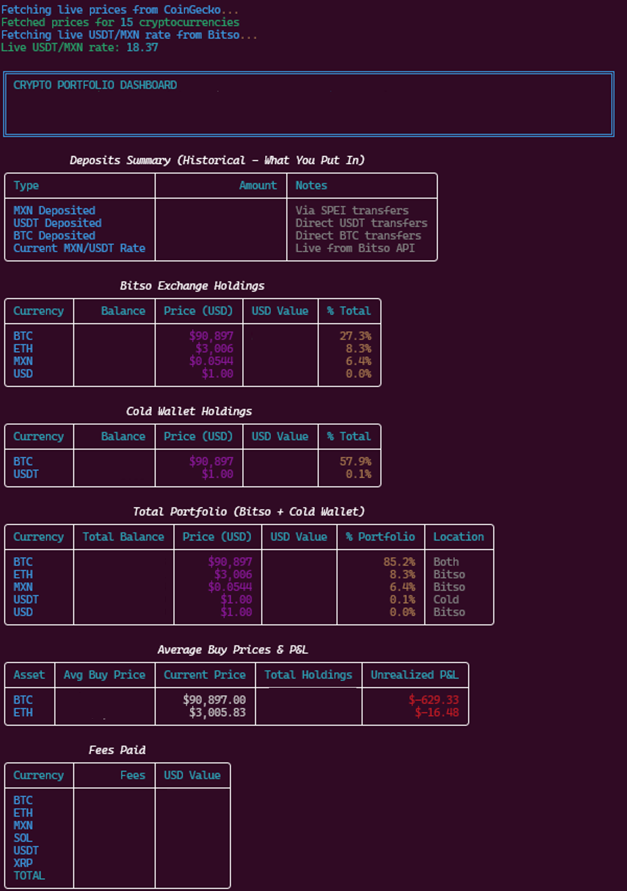

# Bitso Portfolio Tracker

Terminal-based cryptocurrency portfolio tracker for Bitso exchange with **real-time live prices** and cold wallet support.

## Features

### Portfolio Dashboard
- Total Portfolio Value in USD (Bitso + Cold Wallet)
- Total Invested (MXN + USDT deposits converted to USD)
- Deposits Summary (shows actual MXN/USDT/BTC deposited)
- Profit & Loss with ROI percentage
- Color-coded terminal output
- **Always uses live prices** - no stale data

### Current Holdings
- Bitso Exchange holdings table
- Cold Wallet holdings table (Ledger, Trezor, etc.)
- Total Portfolio combined table (Bitso + Cold Wallet merged)
  - Shows total balance per currency
  - Indicates location (Bitso, Cold, or Both)
- USD value for each asset
- Portfolio allocation percentages
- Sorted by USD value (largest first)

### Average Buy Prices & Unrealized P&L
- Average buy price for each crypto (in USDT)
- Current market price (live from CoinGecko API)
- Unrealized profit/loss per asset
- Color-coded (green = profit, red = loss)
- Uses weighted average cost basis accounting

### Live Prices (Always Enabled)
- **Cryptocurrency prices:** CoinGecko API
  - Supports: BTC, ETH, SOL, XRP, USDT, and 11 more coins
  - Free API, no registration required
- **USDT/MXN exchange rate:** Bitso API
  - Real-time market rate for accurate MXN conversions
  - Essential for correct cost basis calculations
- **No hardcoded fallbacks** - program fails if APIs are unreachable (ensures data accuracy)

### Fees Tracking
- Total fees paid per currency
- USD value of all fees
- Total fees paid across all transactions

## Quick Start

```bash
# Run the portfolio tracker (always fetches live prices)
python3 balance.py

# Add cold wallet holdings
python3 balance.py --add-cold btc 0.01
python3 balance.py --add-cold eth 0.5

# List cold wallet only
python3 balance.py --list-cold

# Remove cold wallet holding
python3 balance.py --remove-cold sol

# Show help
python3 balance.py --help
```

**Note:** Internet connection required - the program fetches live prices from CoinGecko and Bitso APIs on every run.

## Cold Wallet Management

Track your Ledger, Trezor, or other cold storage holdings alongside your Bitso exchange balance.

```bash
# Add 0.01 BTC to cold wallet
python3 balance.py --add-cold btc 0.01

# Update to 2.5 ETH (overwrites previous amount)
python3 balance.py --add-cold eth 2.5

# View only cold wallet holdings
python3 balance.py --list-cold

# Remove SOL from cold wallet
python3 balance.py --remove-cold sol
```

Cold wallet data is stored in `cold_wallet.json` and automatically included in your total portfolio value.

## Project Structure

- **balance.py** - Main portfolio tracker with all features
- **requirements.txt** - Python dependencies
- **cold_wallet.json** - Cold wallet data storage (auto-created)
- **samples/** - Sample CSV files showing expected format

## How It Works

The calculator processes your Bitso CSV files:
1. **funding.csv** - Deposits (SPEI, transfers, etc.)
2. **conversion.csv** - Currency conversions
3. **trade.csv** - Buy/sell trades
4. **withdrawal.csv** - Withdrawals

Then fetches live prices from:
- **CoinGecko API** - Current cryptocurrency prices in USD
- **Bitso API** - Current USDT/MXN exchange rate

It calculates:
- Net balance for each currency
- USD values using **live market prices**
- Average buy prices (weighted by amount from trade history)
- Unrealized P&L (current value - cost basis)
- Total portfolio metrics with accurate cost basis

## Example Output



<details>
<summary>Click to see text output</summary>

```
Fetching live prices from CoinGecko...
Fetched prices for 15 cryptocurrencies
Fetching live USDT/MXN rate from Bitso...
Live USDT/MXN rate: 20.15

╔════════════════════════════════════════════════════════════╗
║ CRYPTO PORTFOLIO DASHBOARD                                 ║
║ Total Value: $12,458.32  (Bitso: $8,234.15 + Cold: $4,224.17)║
║ Total Invested: $10,500.00                                 ║
║ P&L: $1,958.32 (+18.65%)                                   ║
╚════════════════════════════════════════════════════════════╝

Deposits Summary (Historical - What You Put In)
Type                    Amount              Notes
MXN Deposited          150,000.00 MXN      Via SPEI transfers
USDT Deposited         2500.00000000 USDT  Direct USDT transfers
BTC Deposited          0.00250000 BTC      Direct BTC transfers
Current MXN/USDT Rate  20.15               Live from Bitso API

Bitso Exchange Holdings
Currency  Balance      Price (USD)  USD Value  % Total
BTC       0.05240000   $92,500      $4,847.00  38.9%
ETH       0.85000000   $3,200       $2,720.00  21.8%
SOL       25.50000000  $98.50       $2,511.75  20.2%
MXN       12,450.00    $0.0496      $617.52    5.0%
USDT      537.88       $1.00        $537.88    4.3%

Cold Wallet Holdings
Currency  Balance      Price (USD)  USD Value  % Total
BTC       0.04500000   $92,500      $4,162.50  33.4%
DOT       150.00000000 $4.12        $618.00    5.0%

Average Buy Prices & P&L
Asset  Avg Buy Price  Current Price  Total Holdings  Unrealized P&L
BTC    $85,230.50     $92,500.00    0.09740000      +$708.28
ETH    $2,850.25      $3,200.00     0.85000000      +$297.29
SOL    $95.40         $98.50        25.50000000     +$79.05
DOT    $3.95          $4.12         150.00000000    +$25.50
```

</details>

## Customization

Edit `balance.py` to:
- Change colors or formatting
- Add more metrics
- Filter different holdings
- Adjust decimal places

## Installation

1. Clone the repository:
```bash
git clone https://github.com/yourusername/bitso_dashboard.git
cd bitso_dashboard
```

2. Create virtual environment:
```bash
python3 -m venv venv
source venv/bin/activate  # On Windows: venv\Scripts\activate
```

3. Install dependencies:
```bash
pip install -r requirements.txt
```

4. Place your Bitso CSV files in the project directory:
   - `funding.csv`
   - `conversion.csv`
   - `trade.csv`
   - `withdrawal.csv`

5. Run the tracker:
```bash
python3 balance.py
```

## Dependencies

- Python 3.8+
- rich 13.7.0 (terminal formatting)
- requests 2.31.0 (API calls)

## Data Privacy

Your CSV files and cold wallet data are stored locally and never uploaded anywhere. The `.gitignore` file ensures your personal data stays private when pushing to GitHub.

## License

MIT License - feel free to modify and use as needed.

---

Keep it simple. Stay informed. Track your crypto.
